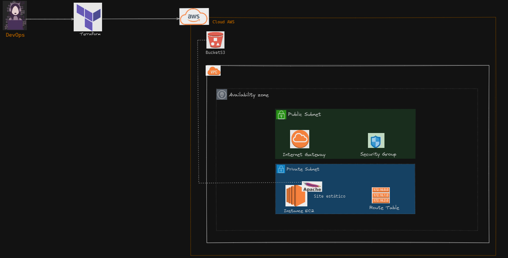

# Construindo uma infraestutura como código (IAC) - Terraform

# Explicando a infraestutura como código (IAC)

A nossa jornada iremos usar o Terraform, para criar todos os recursos de forma automatizada na cloud AWS, para ter mais praticidade, e poder modificar a infra conforme a necessidade. Este projeto é uma camada bem simples, que quero te apresentar e mostra a você que está començando, nos estudos de DevOps e/ou tem curiosidade de criar uma infra do zero, aqui você terá umaum ponto de partida, euma  breve noção de como funciona os recursos via terraform na cloud.

Acesse meu blog com todo o passo a passo, e uma ótima jornada 🙃

https://medium.com/@meuprojetodevops/criando-minha-primeira-infraestrutura-como-código-iac-do-zero-usando-técnicas-do-terraform-795feed77f7d

